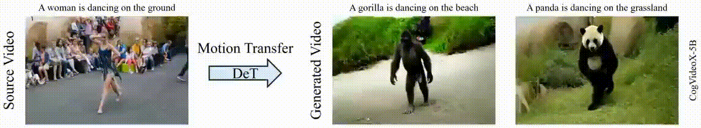
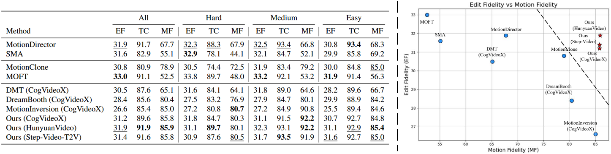

<br />
<p align="center">
  <h1 align="center">Decouple and Track: Benchmarking and Improving Video Diffusion Transformers for Motion Transfer [ICCV 2025]</h1>
  <p align="center">
    <a href="https://scholar.google.com.hk/citations?user=VpSqhJAAAAAJ&hl=zh-CN"><strong>Qingyu Shi</strong></a>
    ·
    <a href="https://jianzongwu.github.io/"><strong>Jianzong Wu</strong></a>
    ·
    <a href="https://noyii.github.io/"><strong>Jinbin Bai</strong></a>
    ·
    <a href="https://zhangzjn.github.io/"><strong>Jiangning Zhang</strong></a>
    ·
    <a href="http://luqi.info/"><strong>Lu Qi</strong></a>
    ·
    <a href="https://lxtgh.github.io/"><strong>Xiangtai Li</strong></a>
    ·
    <a href="https://scholar.google.com/citations?user=T4gqdPkAAAAJ&hl=zh-CN"><strong>Yunhai Tong</strong></a>
  <br >
     Peking University, Nanyang Technological University, National University of Singapore, Zhejiang University, UC Merced
  </p>

  <div align="center">
    <a href='https://arxiv.org/pdf/2503.17350'></a> &ensp;
    <a href='https://shi-qingyu.github.io/DeT.github.io/'></a> &ensp;
    <a href='https://huggingface.co/datasets/QingyuShi/MTBench'></a> &ensp;
  </div>
</p>
<br/>

## Introduction
We propose DeT, a tuning-based method that adapts Video Diffusion Transformers (DiT) for motion transfer tasks.



## Data Preparation
We provide three examples in the directory ``./data``:
```text
├── data
    ├── dance-twirl
        ├── videos
            ├── dance-twirl.mp4
        ├── masks
            ├── dance-twirl
                ├── 00000.png
                ...
        ├── trajectories
            ├── dance-twirl.pth
        ├── prompts.txt
        ├── trajectories.txt
        ├── videos.txt
    ├── dog-agility
    ...
    ├── snowboard
    ...
```
**[Optional]** You can use your own source videos. Please prepare and organize the datasets following the provided examples. Additionally, annotate trajectories in the source video for the dense point tracking loss:
```bash
cd checkpoints
wget https://hf-mirror.com/facebook/cotracker3/resolve/main/scaled_online.pth
cd ..
python generate_trajectories.py --root ./data/your-data    % should be a directory such as ./data/dance-twirl
```

## Training
Please replace the model and data paths before running the script：
```
% if you are in mainland China, we recommend to use hf-mirror.
export HF_ENDPOINT=https://hf-mirror.com
bash train_cogvideox.sh
```

## Inference
Please replace the model and data paths before running the script：
```
bash run_cogvideox.sh
```

## MTBench
Download MTBench with:

```
huggingface-cli download QingyuShi/MTBench --local-dir ./MTBench --repo-type dataset
```
For quicker ablation studies, a lightweight subset—``MTBench_subset``—is included in the repository to reduce computational overhead.

The evaluation script is located at ``./evaluation.py``.




## Citing DeT
```
@article{DeT,
  title={Decouple and Track: Benchmarking and Improving Video Diffusion Transformers for Motion Transfer},
  author={Shi, Qingyu and Wu, Jianzong and Bai, Jinbin and Zhang, Jiangning and Qi, Lu and Li, Xiangtai and Tong, Yunhai},
  journal={arXiv preprint arXiv:2503.17350},
  year={2025}
}
```
