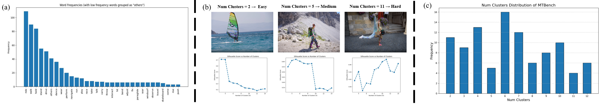

<br />
<p align="center">
  <h1 align="center">Decouple and Track: Benchmarking and Improving Video Diffusion Transformers for Motion Transfer</h1>
  <p align="center">
    <a href="https://scholar.google.com.hk/citations?user=VpSqhJAAAAAJ&hl=zh-CN"><strong>Qingyu Shi</strong></a>
    ·
    <a href="https://jianzongwu.github.io/"><strong>Jianzong Wu</strong></a>
    ·
    <a href="https://noyii.github.io/"><strong>Jinbin Bai</strong></a>
    ·
    <a href="https://zhangzjn.github.io/"><strong>Jiangning Zhang</strong></a>
    ·
    <a href="http://luqi.info/"><strong>Lu Qi</strong></a>
    ·
    <a href="https://lxtgh.github.io/"><strong>Xiangtai Li</strong></a>
    ·
    <a href="https://scholar.google.com/citations?user=T4gqdPkAAAAJ&hl=zh-CN"><strong>Yunhai Tong</strong></a>
  <br >
     PKU, NTU, NUS, ZJU, UC Merced
  </p>

  <p align="center">
    <a href='https://arxiv.org/pdf/2503.17350'>
       </a>
    <a href='https://shi-qingyu.github.io/DeT.github.io/' style='padding-left: 0.5rem;'>
       </a>
    <!-- <a href='https://huggingface.co/spaces/shilinxu/rap-sam' style='padding-left: 0.5rem;'>
       </a> -->
  </p>
<br/>

## Introduction
We propose DeT, a tuning-based method that adapts Video Diffusion Transformers (DiT) for motion transfer tasks.


## Requirements
Install the packages, we recommend using conda to set up a Python environment:
```bash
conda create -n det python=3.10
conda activate det
pip install -r requirements.txt
```

## Training
Please replace the model and data paths before running the script：
```
export HF_ENDPOINT=https://hf-mirror.com
bash train_conv1d_cogvideox.sh
```

## Inference
Please replace the model and data paths before running the script：
```
python test_conv1d_cogvideox.py
```

## MTBench
The benchmark and test code will be release soon!!! Please stay tuned.
